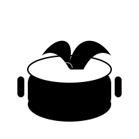
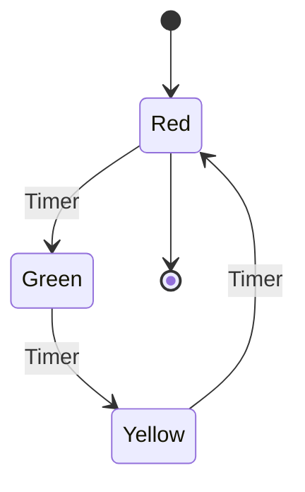

<div align="center">
  
  
  # Sargoth Mermaid Renderer - MCP Server
  
  **AI-Powered Diagram Generation - From Natural Language to Professional Visuals**
  
  [](https://modelcontextprotocol.io/)
  [](https://www.python.org/)
  [](LICENSE)
</div>

---

## 🚀 Transform Ideas into Diagrams with AI

Seamlessly convert your ideas into stunning diagrams using AI. Simply describe your workflow, process, or system in plain English to your LLM assistant, and instantly get professional SVG/PNG diagrams rendered through our high-performance Mermaid engine.

**The Perfect AI Workflow:**
- 💬 Describe your diagram needs in natural language to Claude/ChatGPT
- 🤖 LLM generates optimized Mermaid code automatically  
- ⚡ Our MCP server renders beautiful, production-ready visuals instantly
- 📥 Export as SVG or PNG with custom themes and scaling

## What is MCP?

[Model Context Protocol (MCP)](https://modelcontextprotocol.io/) is an open standard that enables AI assistants to securely connect to external data sources and tools. By creating an MCP server for our Mermaid renderer, we allow AI assistants to:

- 🎨 Generate diagrams in real-time during conversations
- ✅ Validate Mermaid syntax and suggest improvements
- 📚 Create visual documentation and explanations
- 🔄 Help users build complex diagrams step by step

## ✨ Features

The MCP server exposes 4 powerful tools:

### 🎨 `render_mermaid_svg`
Generate SVG diagrams from Mermaid code with theme support.

**Parameters:**
- `code` (required): Mermaid diagram code
- `theme` (optional): Theme (`modern`, `classic`, `dark`, `minimal`)

### 🖼️ `render_mermaid_png`
Generate PNG images from Mermaid code with scaling.

**Parameters:**
- `code` (required): Mermaid diagram code
- `theme` (optional): Theme (`modern`, `classic`, `dark`, `minimal`)
- `scale` (optional): PNG scale factor (1-4, default: 2)

### ✅ `validate_mermaid`
Validate Mermaid syntax and analyze diagram complexity.

**Parameters:**
- `code` (required): Mermaid diagram code to validate

### 💡 `suggest_mermaid_improvements`
Analyze Mermaid code and suggest improvements or fixes.

**Parameters:**
- `code` (required): Mermaid diagram code to analyze
- `diagram_type` (optional): Expected diagram type for targeted suggestions

## 📦 Installation

### Prerequisites

1. **Python 3.8+** installed
2. **Sargoth Mermaid Renderer API** running (see [main project](https://github.com/floor-licker/mermaid-render))
3. **MCP-compatible AI assistant** (Claude Desktop, etc.)

### Step 1: Install MCP Dependencies

```bash
# Install MCP server dependencies
pip install -r requirements.txt
```

### Step 2: Make the Server Executable

```bash
chmod +x mcp_server.py
```

### Step 3: Test the Server

```bash
# Start your Mermaid API first
python ../app.py

# In another terminal, test the MCP server
python mcp_server.py --api-url http://localhost:5000
```

## 🔌 Integration with AI Assistants

### Claude Desktop

1. **Locate your Claude Desktop config file:**
   - **macOS**: `~/Library/Application Support/Claude/claude_desktop_config.json`
   - **Windows**: `%APPDATA%\Claude\claude_desktop_config.json`

2. **Add the MCP server configuration:**

```json
{
  "mcpServers": {
    "mermaid-renderer": {
      "command": "python",
      "args": ["/absolute/path/to/mcp_server.py"],
      "env": {
        "MERMAID_API_URL": "http://localhost:5000"
      }
    }
  }
}
```

3. **Restart Claude Desktop**

4. **Test the integration:**
   - Open a new conversation
   - Ask: "Can you create a flowchart showing a simple user login process?"
   - Claude should use the Mermaid tools to generate the diagram!

### Other MCP Clients

The server works with any MCP-compatible client. Configure it using:

```json
{
  "command": "python",
  "args": ["mcp_server.py"],
  "env": {
    "MERMAID_API_URL": "http://localhost:5000"
  }
}
```

## 💬 Usage Examples

Once integrated, you can ask your AI assistant things like:

### Basic Diagram Generation
> "Create a sequence diagram showing how a user logs into a web application"

### Validation & Improvement
> "Check this Mermaid code for errors: \`\`\`graph TD A -> B\`\`\`"

### Complex Workflows
> "Generate a flowchart for a CI/CD pipeline, then convert it to PNG format"

### Educational Content
> "Create a class diagram for a simple e-commerce system and explain each component"

## 🎯 Example Conversation

**You:** "Can you create a state diagram for a simple traffic light system?"

**AI Assistant:** *Uses `render_mermaid_svg` tool*



**AI:** "I've created an SVG diagram of a traffic light state machine! The diagram shows the three states (Red, Green, Yellow) and the timer-based transitions between them. Would you like me to convert this to PNG format or modify the design?"

## ⚙️ API Configuration

### Environment Variables

- `MERMAID_API_URL`: Base URL of your Mermaid renderer API (default: `http://localhost:5000`)

### Command Line Options

```bash
python mcp_server.py --help

# Custom API URL
python mcp_server.py --api-url http://your-server:8080
```

## 🔧 Troubleshooting

### Server Won't Start
1. Ensure the Mermaid API is running on the specified URL
2. Check that all dependencies are installed: `pip install -r requirements.txt`
3. Verify Python version: `python --version` (needs 3.8+)

### AI Assistant Can't Find Tools
1. Check the MCP configuration file path
2. Ensure the server path in config is absolute
3. Restart your AI assistant after config changes
4. Check logs for connection errors

### Rendering Fails
1. Verify the Mermaid API is accessible: `curl http://localhost:5000/health`
2. Test with simple Mermaid code first
3. Check API logs for detailed error messages

## 🔒 Security Considerations

- The MCP server only connects to your local Mermaid API
- No external network requests are made
- Diagram data stays on your local machine
- Consider firewall rules if exposing the API externally

## 🎨 Advanced Usage

### Custom Themes
The server supports all themes available in your Mermaid renderer:
- `modern` (default)
- `classic`
- `dark`
- `minimal`

### Batch Processing
While the MCP protocol processes tools individually, you can ask the AI to generate multiple diagrams in sequence.

### Integration with Documentation
Use the MCP server to automatically generate diagrams for:
- Technical documentation
- Architecture diagrams
- Process flows
- Educational materials

## 🤝 Contributing

This MCP server is part of the Sargoth Mermaid Renderer project. To contribute:

1. Fork the repository
2. Create a feature branch
3. Add tests for new functionality
4. Submit a pull request

## 📄 License

Same as the main Sargoth Mermaid Renderer project.

---

<div align="center">
  
**Ready to supercharge your AI assistant with diagram generation?**

Install the MCP server and start creating beautiful visuals in your conversations! 🚀

[🌟 Star this repo](https://github.com/floor-licker/sargoth-mpc) • [📖 Main Project](https://github.com/floor-licker/mermaid-render) • [🐛 Report Bug](https://github.com/floor-licker/sargoth-mpc/issues)

</div> 